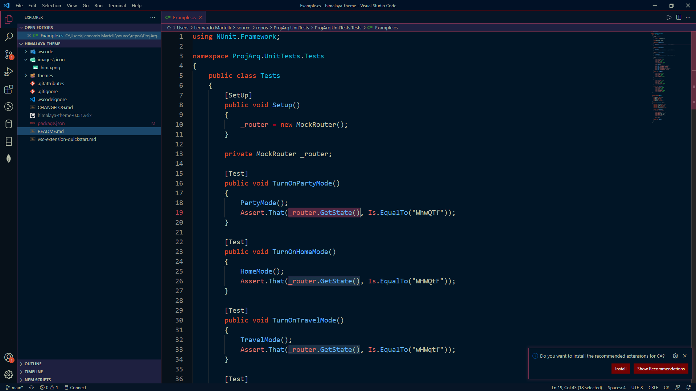

# Himalaya Theme for VS Code

Thanks for checking out Himalaya Theme for VS Code. The color pallete is from a pic that i found on internet time ago.

## Installation

1. Open the extensions sidebar on Visual Studio Code
1. Search for Himalaya Theme
1. Click Install
1. Click Reload to reload your editor
1. Select the Manage Cog (bottom left) > Color Theme ＞ Himalaya Theme
1. 🌟🌟🌟🌟🌟 Rate five-stars 😃

## Issues & Suggestions

For any issues or suggestions, please use [GitHub issues](https://github.com/leonardomartelli/himalaya-theme/issues).